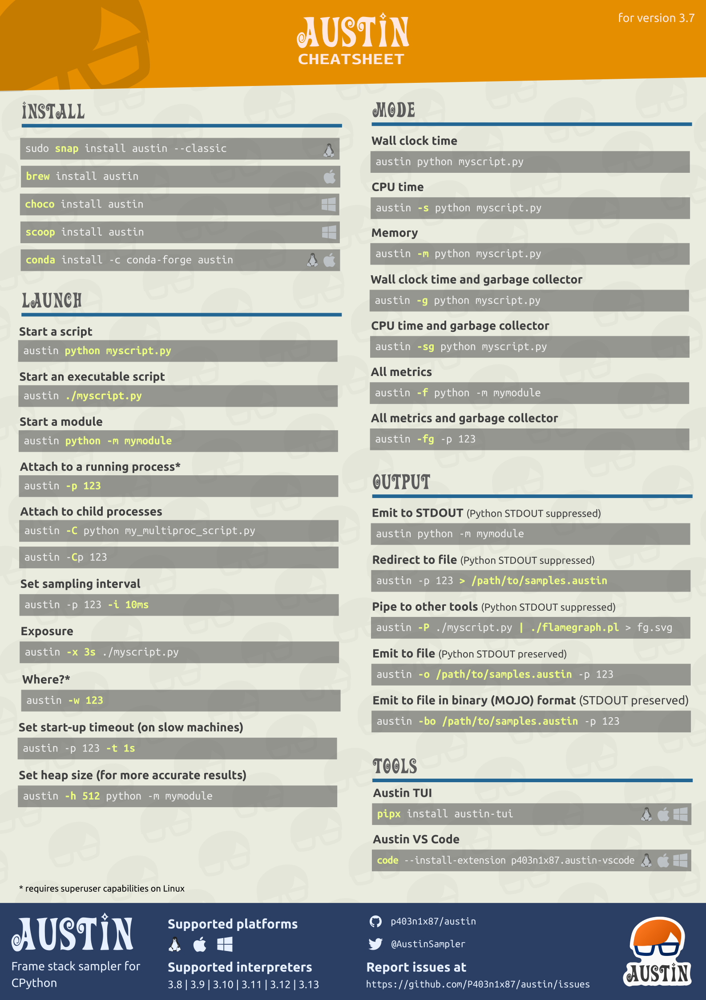

<h3 align="center">A Frame Stack Sampler for CPython</h3>

  
  &nbsp;&nbsp;&nbsp;&nbsp;
  
  &nbsp;&nbsp;&nbsp;&nbsp;
  

  
  
  
  
  

   
  
  
  
  <!--  -->
  
  

  

  <a href="#synopsis"><b>Synopsis</b></a>&nbsp;&bull;
  <a href="#installation"><b>Installation</b></a>&nbsp;&bull;
  <a href="#usage"><b>Usage</b></a>&nbsp;&bull;
  <a href="#cheat-sheet"><b>Cheat sheet</b></a>&nbsp;&bull;
  <a href="#compatibility"><b>Compatibility</b></a>&nbsp;&bull;
  <a href="#why--austin"><b>Why  Austin</b></a>&nbsp;&bull;
  <a href="#examples"><b>Examples</b></a>&nbsp;&bull;
  <a href="#contribute"><b>Contribute</b></a>

  

----

<i>This is the nicest profiler I’ve found for Python. It’s
cross-platform, doesn’t need me to change the code that’s being profiled, and
its output can be piped directly into <code>flamegraph.pl</code>. I just used it
to pinpoint a gross misuse of SQLAlchemy at work that’s run in some code at the
end of each day, and now I can go home earlier.</i>  -- gthm on <a
href="https://lobste.rs/s/qairy5/austin_python_frame_stack_sampler_for">lobste.rs</a>

<i>If people are looking for a profiler, Austin looks pretty
cool. Check it out!</i>  -- Michael Kennedy on <a
href="https://www.youtube.com/watch?v=eFgybynhMrs">Python Bytes 180</a>

 <a href="https://twitter.com/AustinSampler">Follow  on </a>

----

# Synopsis

Austin is a Python frame stack sampler for CPython written in pure C. Samples
are collected by reading the CPython interpreter virtual memory space to
retrieve information about the currently running threads along with the stack of
the frames that are being executed. Hence, one can use Austin to easily make
powerful statistical profilers that have minimal impact on the target
application and that don't require any instrumentation.

The key features of Austin are:
- Zero instrumentation;
- Minimal impact;
- Fast and lightweight;
- Time and memory profiling;
- Built-in support for multi-process applications (e.g. `mod_wsgi`).

The simplest way to turn Austin into a full-fledged profiler is to use together
with the [VS
Code](https://marketplace.visualstudio.com/items?itemName=p403n1x87.austin-vscode)
extension or combine it with [FlameGraph] or [Speedscope]. However, Austin's
binary output can be piped into any other external or custom tools for further
processing. Look, for instance, at the following Python TUI

  

Check out [A Survey of Open-Source Python
Profilers](https://www.usenix.org/system/files/login/articles/login_winter19_12_norton.pdf)
by Peter Norton for a general overview of Austin.

Keep reading for more tool ideas and examples!

---

💜 <i>Austin is a free and open-source project. A lot of
effort goes into its development to ensure the best performance and that it
stays up-to-date with the latest Python releases. If you find it useful,
consider <a href="https://github.com/sponsors/P403n1x87">sponsoring</a> this
project.</i> 🙏

---

# Installation

Austin is available to install from [PyPI](pypi) and from the major software
repositories of the most popular platforms. Check out the [latest release] page
for pre-compiled binaries and installation packages.

On all supported platforms and architectures, Austin can be installed from PyPI
with `pip` or `pipx` via the commands

~~~
pip install austin-dist
~~~
or
~~~
pipx install austin-dist
~~~

On Linux, it can be installed using `autotools` or as a snap from the [Snap
Store](https://snapcraft.io/store). The latter will automatically perform the
steps of the `autotools` method with a single command. On distributions derived
from Debian, Austin can be installed from the official repositories with
`apt`. Anaconda users can install Austin from [Conda Forge].

On Windows, Austin can be easily installed from the command line using either
[Chocolatey] or [Scoop]. Alternatively, you can download the installer from the
[latest release] page.

On macOS, Austin can be easily installed from the command line using [Homebrew].
Anaconda users can install Austin from [Conda Forge].

For any other platforms, compiling Austin from sources is as easy as cloning the
repository and running the C compiler. The [Releases][releases] page has many
pre-compiled binaries that are ready to be uncompressed and used.

## With `autotools`

Installing Austin using `autotools` amounts to the usual `./configure`, `make`
and `make install` finger gymnastic. The only dependency is the standard C
library. Before proceeding with the steps below, make sure that the `autotools`
are installed on your system. Refer to your distro's documentation for details
on how to do so.

~~~ console
git clone --depth=1 https://github.com/P403n1x87/austin.git && cd austin
autoreconf --install
./configure
make
make install
~~~

> **NOTE** Some Linux distributions, like Manjaro, might require the execution
> of `automake --add-missing` before `./configure`.

Alternatively, sources can be compiled with just a C compiler (see below).

## From the Snap Store

Austin can be installed on [many major Linux
distributions](https://snapcraft.io/docs/installing-snapd) from the Snap Store
with the following command

~~~ console
sudo snap install austin --classic
~~~

## On Debian and Derivatives

On March 30 2019 Austin was accepted into the official Debian repositories and
can therefore be installed with the `apt` utility.

~~~ console
sudo apt update -y && sudo apt install austin -y
~~~

## On macOS

Austin can be installed on macOS using [Homebrew](https://docs.brew.sh):

~~~ console
brew install austin
~~~

## From Chocolatey

To install [Austin from Chocolatey](https://chocolatey.org/packages/austin), run
the following command from the command line or from PowerShell

~~~ console
choco install austin
~~~

To upgrade run the following command from the command line or from PowerShell:

~~~ console
choco upgrade austin
~~~

## From Scoop

To install Austin using Scoop, run the following command from the command line
or PowerShell

~~~ console
scoop install austin
~~~

To upgrade run the following command from the command line or PowerShell:

~~~ console
scoop update
~~~

## From Conda Forge

Anaconda users on Linux and macOS can install Austin from [Conda Forge] with the
command

~~~ console
conda install -c conda-forge austin
~~~

## From Sources without `autotools`

To install Austin from sources using the GNU C compiler, without `autotools`,
clone the repository with

~~~ console
git clone --depth=1 https://github.com/P403n1x87/austin.git
~~~

On Linux, one can then use the command

~~~ console
gcc -O3 -Os -Wall -pthread src/*.c -o src/austin
~~~

whereas on macOS it is enough to run

~~~ console
gcc -O3 -Os -Wall src/*.c -o src/austin
~~~

On Windows, the `-lpsapi -lntdll` switches are needed

~~~ console
gcc -O3 -Os -Wall -lpsapi -lntdll src/*.c -o src/austin
~~~

Add `-DDEBUG` if you need a more verbose log. This is useful if you encounter a
bug with Austin and you want to report it here.

# Usage

<!-- [[[cog
from subprocess import check_output
print("~~~")
print(check_output(["src/austin", "--help"]).decode().strip())
print("~~~")
]]] -->
~~~
Usage: austin [OPTION...] command [ARG...]
Austin is a frame stack sampler for CPython that is used to extract profiling
data out of a running Python process (and all its children, if required) that
requires no instrumentation and has practically no impact on the tracee.

  -c, --cpu                  Sample on-CPU stacks only.
  -C, --children             Attach to child processes.
  -f, --full                 Produce the full set of metrics (time +mem -mem).
  -g, --gc                   Sample the garbage collector state.
  -i, --interval=n_us        Sampling interval in microseconds (default is
                             100). Accepted units: s, ms, us.
  -m, --memory               Profile memory usage.
  -o, --output=FILE          Specify an output file for the collected samples.
  -p, --pid=PID              Attach to the process with the given PID.
  -P, --pipe                 Pipe mode. Use when piping Austin output.
  -t, --timeout=n_ms         Start up wait time in milliseconds (default is
                             3000). Accepted units: s, ms.
  -w, --where=PID            Dump the stacks of all the threads within the
                             process with the given PID.
  -x, --exposure=n_sec       Sample for n_sec seconds only.
  -?, --help                 Give this help list
      --usage                Give a short usage message
  -V, --version              Print program version

Mandatory or optional arguments to long options are also mandatory or optional
for any corresponding short options.

Report bugs to <https://github.com/P403n1x87/austin/issues>.
~~~
<!-- [[[end]]] -->

Austin generates binary output in the [MOJO] format. This is a compact binary
representation of the collected data that can be processed by the `mojo2austin`
tool that comes with the [`austin-python`] Python package to produce the more
commonly used collapsed stack format. The MOJO format can also be converted to
the [Speedscope] JSON format using the `austin2speedscope` tool that also comes
with the [`austin-python`] Python package. If you use Visual Studio Code, you
can use the [Austin VS Code extension] to visualise the profile data directly
in the editor.

> [!IMPORTANT]
> If you are running Austin directly in a terminal, make sure to either redirect
> the output to a file or give a destination file with the `-o/--output` option
> to avoid the terminal being flooded with binary data.

## Environment variables

Some behaviour of Austin can be configured via environment variables.

| Variable               | Effect                                                               |
| ---------------------- | -------------------------------------------------------------------- |
| `AUSTIN_NO_LOGGING`    | Disables all [log messages](#logging) (since Austin 3.4.0).          |
| `AUSTIN_PAGE_SIZE_CAP` | Cap the page size used to perform remote reads (since Austin 4.0.0). |

## Column-level Location Information

Since Python 3.11, code objects carry finer-grained location information at the
column level. When using the binary MOJO format, Austin can extract this extra
location information when profiling code running with versions of the
interpreter that expose this data.

*Since Austin 3.5.0*.

## Memory and Full Metrics

When profiling in memory mode with the `-m` or `--memory` switch, the metric
value associated with each stack is the memory delta between samples, measured
in bytes. In full mode (`-f` or `--full` switches), each sample will include
both a time and memory metric, plus the information of whether the stack was on
CPU. This is useful if you want to collect wall-time/CPU-time and memory
profiles in a single run.

> [!NOTE]
> The reported memory allocations and deallocations are obtained by computing
> resident memory deltas between samples. Hence these values give an idea of how
> much _physical_ memory is being requested/released.

## Multi-process Applications

Austin can be told to profile multi-process applications with the `-C` or
`--children` switch. This way Austin will look for new children of the parent
process.

## Sub-interpreters

Austin has support for Python applications that make use of sub-interpreters.
This means that Austin will sample all the sub-interpreters that are running
within each process making up the Python application.

*Since Austin 3.6.0*.

## Garbage Collector Sampling

Austin can sample the Python garbage collector state for applications running
with Python 3.7 and later versions. If the `-g`/`--gc` option is passed, Austin
will append `:GC:` at the end of each collected frame stack whenever the garbage
collector is collecting. This gives you a measure of how *busy* the Python GC is
during a run.

*Since Austin 3.1.0*.

## Where?

If you are only interested in what is currently happening inside a Python
process, you can have a quick overview printed on the terminal with the
`-w/--where` option. This takes the PID of the process whose threads you want to
inspect, e.g.

~~~ console
sudo austin -w `pgrep -f my-running-python-app`
~~~

Below is an example of what the output looks like

  

This works with the `-C/--children` option too. The emojis to the left indicate
whether the thread is active or sleeping and whether the process is a child or
not.

*Since Austin 3.3.0*.

## Sampling Accuracy

Austin can sample stacks very rapidly, guaranteeing high accuracy, as well as
allowing to reach very high sampling rates, if required. This makes Austin
suitable for profiling applications in production with almost no compromise
between accuracy and performance.

## Native Frame Stack

If you want observability into the native frame stacks, you can use the
`austinp` variant of `austin` which can be obtained by compiling the source
with `-DAUSTINP` on Linux, or from the released binaries.

`austinp` makes use of `ptrace` to halt the application and grab a
snapshot of the call stack with `libunwind`. If you are compiling `austinp` from
sources make sure that you have the development version of the `libunwind`
library available on your system, for example on Ubuntu,

~~~ console
sudo apt install libunwind-dev binutils-dev
~~~

and compile with

~~~ console
gcc -O3 -Os -Wall -pthread src/*.c -DAUSTINP -lunwind-ptrace -lunwind-generic -lbfd -o src/austinp
~~~

then use as per normal. The extra `-k/--kernel` option is available with
`austinp` which allows sampling kernel call stacks as well.

> [!WARNING]
> Since `austinp` uses `ptrace`, the impact on the tracee is no longer minimal
> and it becomes higher at smaller sampling intervals. Therefore the use of
> `austinp` is not recommended in production environments. For this reason, the
> default sampling interval for `austinp` is 10 milliseconds.

The `austinp-resolve` tool from the [`austin-python`] Python package can be used
to resolve the VM addresses to source and line numbers, provided that the
referenced binaries have DWARF debug symbols. Internally, the tool uses
`addr2line(1)` to determine the source name and line number given an address,
when possible.

> [!NOTE]
> Whilst `austinp` comes with a stripped-down implementation of `addr2line`, it
> is only used for the "where" option, as resolving symbols at runtime is
> expensive. This is to minimise the impact of austinp on the tracee, increase
> accuracy and maximise the sampling rate.

The [where](#where) option is also available for the `austinp` variant and will
show both native and Python frames. Highlighting helps tell frames apart. The
`-k` option outputs Linux kernel frames too, as shown in this example

  

> [!NOTE]
> If you have installed Austin from the Snap Store, the `austinp` executable
> will be available as `austin.p` from the command line.

## Logging

Austin uses `syslog` on Linux and macOS, and `%TEMP%\austin.log` on Windows
for log messages, so make sure to watch these to get execution details and
statistics. _Bad_ frames are output together with the other frames. In general,
entries for bad frames will not be visible in a flame graph as all tests show
error rates below 1% on average.

Logging can be disabled using [environment variables](#environment-variables).

## Cheat sheet

All the above Austin options and arguments are summarised in a cheat sheet that
you can find in the [doc](https://github.com/P403n1x87/austin/blob/master/doc/)
folder in either the SVG, PDF or PNG format

  

# Compatibility

Austin supports Python 3.9 through 3.14, and has been tested on the following
platforms and architectures

|             |  |  |  |
| ----------- | ------------------------- | ------------------------ | -------------------------- |
| **x86_64**  | ✓                         | ✓                        | ✓                          |
| **i686**    | ✓                         |                          | ✓                          |
| **armv7**   | ✓                         |                          |                            |
| **arm64**   | ✓                         |                          | ✓                          |
| **ppc64le** | ✓                         |                          |                            |

If you are looking for support for older versions of CPython, the following table
summarises the compatibility of Austin with CPython versions

| CPython Versions  | Austin Version |
| ----------------- | -------------- |
| 2.3-2.7, 3.3-3.11 | 3.5            |
| 3.8-3.13          | 3.7            |
| 3.9-3.14          | 4.0            |

> [!NOTE]
> Austin *might* work with other platforms and architectures not listed above.
> So it is worth giving it a try even if your system is not listed below. If you
> are looking for support for Python < 3.8, you can use Austin 3.5.

Because of platform-specific details, Austin usage may vary slightly. Below are
further compatibility details to be aware of.

## On Linux

Austin requires the `CAP_SYS_PTRACE` capability to attach to an external
process. This means that you will have to either use ``sudo`` when attaching to
a running Python process or grant the CAP_SYS_PTRACE capability to the Austin
binary with, e.g.

~~~ console
sudo setcap cap_sys_ptrace+ep `which austin`
~~~

To use Austin with Docker, the `--cap-add SYS_PTRACE` option needs to be passed
when starting a container.

## On MacOS

Due to the **System Integrity Protection**, introduced in **MacOS** with El
Capitan, and the [Hardened Runtime][hardened runtime], introduced in Mojave,
Austin cannot profile Python processes that use an executable located in the
`/bin` folder, or code-signed, even with `sudo`. This is the case for the
system-provided version of Python, and the one installed with the official
installers from [python.org](https://python.org). Other installation methods,
like [pyenv][pyenv] or [Anaconda][anaconda] or
[Homebrew](https://formulae.brew.sh/formula/austin) are known to work with
Austin, out of the box.

To use Austin with Python from the official installer, you could remove the
signature from the binaries with
~~~ console
codesign --remove-signature /Library/Frameworks/Python.framework/Versions/<M.m>/bin/python3
codesign --remove-signature /Library/Frameworks/Python.framework/Versions/<M.m>/Resources/Python.app/Contents/MacOS/Python
~~~
Alternatively, you could self-sign the Austin binary with the [Debugging Tool
Entitlement][dte], as done for debugging tools like GDB. However, this method
has not been tested.

> Austin requires the use of `sudo` to work on MacOS. To avoid having to type
> the password every time you use Austin, consider adding a rule to the
> `sudoers` file, e.g.
> ~~~
> yourusername  ALL = (root) NOPASSWD: /usr/local/bin/austin
> ~~~

# Why Austin

When there already are similar tools out there, it's normal to wonder why one
should be interested in yet another one. So here is a list of features that
currently distinguish Austin.

- **Written in pure C** Austin is written in pure C code. There are no
  dependencies on third-party libraries except for the standard C library and
  the API provided by the Operating System.

- **Just a sampler** Austin is just a frame stack sampler. It looks into a
  running Python application at regular intervals of time and dumps whatever
  frame stack it finds. The samples can then be analysed at a later time so that
  Austin can sample at rates higher than other non-C alternatives that perform
  some aggregations at run-time.

- **Simple output, powerful tools** Austin uses the collapsed stack format of
  FlameGraph that is easy to parse. You can then go and build your own tool to
  analyse Austin's output. You could even make a _player_ that replays the
  application execution in slow motion, so that you can see what has happened in
  temporal order.

- **Small size** Austin compiles to a single binary executable of just a bunch
of KB.

- **Easy to maintain** Occasionally, the Python C API changes and Austin will
need to be adjusted to new releases. However, given that Austin, like CPython,
is written in C, implementing the new changes is rather straight-forward.

# Examples

To profile a Python script, run Austin with the command

~~~ console
austin -o profile.mojo python myscript.py
~~~

To profile a running Python application, attach Austin to it with the
`-p/--pid` option, e.g.

~~~ console
austin -o profile.mojo -p <pid>
~~~
where `<pid>` is the process ID of the running Python application you want to
profile. If you also want to profile the child processes of the target
application, add the `-C/--children` option to the command line:

~~~ console
austin -o profile.mojo -Cp <pid>
~~~

For example, to profile an Apache2 WSGI application, one can attach Austin to
the web server with

~~~ console
austin -Cp `pgrep apache2 | head -n 1` > profile.mojo
~~~

Any child processes will be automatically detected as they are created and
Austin will sample them too.

## IDE Extensions

It is easy to write your own extension for your favourite text editor. This, for
example, is a demo of a [Visual Studio Code] extension that highlights the most
hit lines of code straight into the editor

  

## Austin TUI

The [Austin TUI] is a text-based user interface for Austin that gives you a
top-like view of what is currently running inside a Python application. It is
most useful for scripts that have long-running procedures as you can see where
execution is at without tracing instructions in your code. You can also save the
collected data from within the TUI and feed it to Flame Graph for visualisation,
or convert it to the [pprof] format.

If you want to give it a go you can install it using `pip` with

~~~ console
pip install austin-tui --upgrade
~~~

and run it with

~~~ console
austin-tui [OPTION...] command [ARG...]
~~~

with the same command line as Austin. Please note that the `austin` binary
should be available from within the `PATH` environment variable in order for the
TUI to work.

> [!IMPORTANT]
> The TUI is based on `python-curses`. The version included with the standard
> Windows installations of Python is broken so it won't work out of the box. A
> solution is to install the wheel of the port to Windows from
> [this](https://www.lfd.uci.edu/~gohlke/pythonlibs/#curses) page. Wheel files
> can be installed directly with `pip`, as described in the
> [linked](https://pip.pypa.io/en/latest/user_guide/#installing-from-wheels)
> page.

<!--  -->

  

## Austin Web

[Austin Web] is a web application that wraps around Austin. At its core, Austin
Web is based on [d3-flame-graph] to display a _live_ flame graph in the browser,
that refreshes every 3 seconds with newly collected samples. Austin Web can also
be used for _remote_ profiling by setting the `--host` and `--port` options.

If you want to give it a go you can install it using `pip` with

~~~ console
pip install austin-web --upgrade
~~~

and run it with

~~~ console
austin-web [OPTION...] command [ARG...]
~~~

with the same command line as Austin. This starts a simple HTTP server that
serves on `localhost` by default. When no explicit port is given, Austin Web
will use an ephemeral one.

Please note that the `austin` binary should be available from within the `PATH`
environment variable in order for Austin Web to work.

  

## Speedscope

Austin output is now supported by [Speedscope]. However, the [`austin-python`]
library comes with format conversion tools that allow converting the output from
Austin to the Speedscope JSON format.

If you want to give it a go you can install it using `pip` with

~~~ console
pip install austin-python --upgrade
~~~

and run it with

~~~ console
austin2speedscope [-h] [--indent INDENT] [-V] input output
~~~

where `input` is a file containing the output from Austin and `output` is the
name of the JSON file to use to save the result of the conversion, ready to be
used on [Speedscope].

  

## Google pprof

Austin's format can also be converted to the Google pprof format using the
`austin2pprof` utility that comes with [`austin-python`]. If you want to give it
a go you can install it using `pip` with

~~~ console
pip install austin-python --upgrade
~~~

and run it with

~~~ console
austin2pprof [-h] [-V] input output
~~~

where `input` is a file containing the output from Austin and `output` is the
name of the protobuf file to use to save the result of the conversion, ready to
be used with [Google's pprof tools][pprof].

# Contribute

If you like Austin and you find it useful, there are ways for you to contribute.

If you want to help with the development, then have a look at the open issues
and have a look at the [contributing guidelines](CONTRIBUTING.md) before you
open a pull request.

You can also contribute to the development of the Austin by becoming a sponsor
and/or by [buying me a coffee](https://www.buymeacoffee.com/Q9C1Hnm28) on BMC or
by chipping in a few pennies on [PayPal.Me](https://www.paypal.me/gtornetta/1).

  

----

  <a href="https://twitter.com/AustinSampler">
    Follow  on 
  </a>

[anaconda]: https://www.anaconda.com/
[`austin-python`]: https://github.com/P403n1x87/austin-python
[Austin TUI]: https://github.com/P403n1x87/austin-tui
[Austin Web]: https://github.com/P403n1x87/austin-web
[Chocolatey]: https://chocolatey.org/
[Conda Forge]: https://anaconda.org/conda-forge/austin
[d3-flame-graph]: https://github.com/spiermar/d3-flame-graph
[dte]: https://developer.apple.com/documentation/bundleresources/entitlements/com_apple_security_cs_debugger
[FlameGraph]: https://github.com/brendangregg/FlameGraph
[hardened runtime]: https://developer.apple.com/documentation/security/hardened_runtime
[Homebrew]: https://formulae.brew.sh/formula/austin
[latest release]: https://github.com/P403n1x87/austin/releases/latest
[MOJO]: https://github.com/P403n1x87/austin/wiki/The-MOJO-file-format
[pprof]: https://github.com/google/pprof
[pyenv]: https://github.com/pyenv/pyenv
[pypi]: https://pypi.org/project/austin-dist/
[releases]: https://github.com/P403n1x87/austin/releases
[Scoop]: https://scoop.sh/
[Speedscope]: https://speedscope.app
[Visual Studio Code]: https://marketplace.visualstudio.com/items?itemName=p403n1x87.austin-vscode
[Wiki]: https://github.com/P403n1x87/austin/wiki
